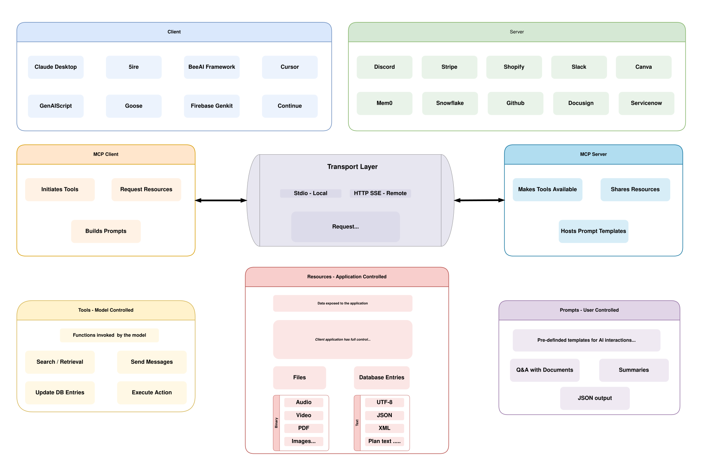
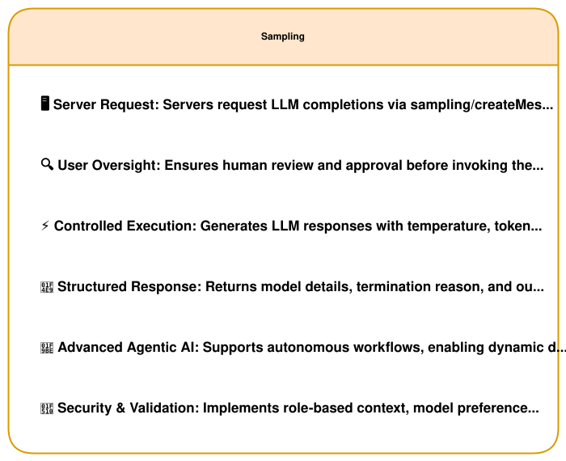
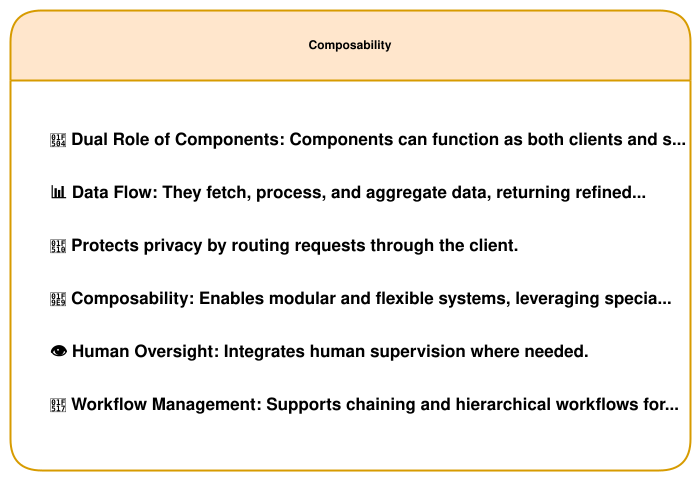
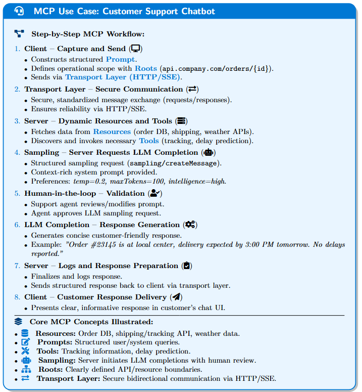

# Model Context Protocol (MCP): Empowering Agentic AI Interactions
**A Survey of the Model Context Protocol (MCP): A Framework for Standardized, Agentic Interactions between LLMs and External Systems**

---

## 📑 Table of Contents
- [Model Context Protocol (MCP): Empowering Agentic AI Interactions](#model-context-protocol-mcp-empowering-agentic-ai-interactions)
  - [Table of Contents](#table-of-contents)
  - [Introduction](#introduction)
  - [Comparative Analysis: MCP vs Traditional APIs](#comparative-analysis-mcp-vs-traditional-apis)
  - [MCP Architecture Overview](#mcp-architecture-overview)
  - [MCP Core Concepts](#mcp-core-concepts)
    - [Resources](#resources)
    - [Prompts](#prompts)
    - [Tools](#tools)
    - [Sampling](#sampling)
    - [Roots](#roots)
    - [Transport Layer](#transport-layer)
  - [Agentic AI & Composability](#agentic-ai--composability)
  - [End-to-End MCP Workflow](#end-to-end-mcp-workflow)
  - [MCP in the Wild](#mcp-in-the-wild)
  - [AI Stacks Supporting MCP](#ai-stacks-supporting-mcp)
  - [Example Clients](#example-clients)
  - [Reference Servers](#reference-servers)

---

## Model Context Protocol (MCP): Empowering Agentic AI Interactions

## Introduction

The **Model Context Protocol (MCP)** provides a structured, standardized way for **Large Language Models (LLMs)** to seamlessly interact with external tools, resources, and systems—much like how APIs and Language Server Protocols revolutionized application integration. MCP empowers the next generation of **agentic AI** by enabling autonomous, secure, and context-rich interactions.

---

## Comparative Analysis: MCP vs Traditional APIs

| Feature                | Traditional APIs     | Model Context Protocol (MCP) |
| ---------------------- | -------------------- | ---------------------------- |
| **Tool Usage**         | Manual, bespoke code | Dynamic, standardized calls  |
| **Prompt Interaction** | Basic text-based     | Structured and context-aware |
| **Context Handling**   | Limited              | Integrated, built-in         |
| **Discovery**          | Manual               | Dynamic and introspective    |
| **Security**           | Varies widely        | Enforced mechanisms          |

---

## MCP Architecture Overview

  
  
<em>Fig. 1: MCP Client-Server Architecture.</em>

---

## MCP Core Concepts

### Resources
- **Structured External Data:** Exposes content such as text, audio, PDFs, system logs, and databases.
- **Types:** Text Resources (e.g., JSON, source code) and Binary Resources (e.g., PDFs, videos).
- **Discovery:** Via endpoints like `resources/list` and URI templates.

### Prompts
- **Reusable Templates:** For standardized LLM interactions.
- **Dynamic Context Injection:** Supports arguments and multi-step workflows.
- **Access Points:** Via `prompts/list` and `prompts/get`.

### Tools

  
  
<em>Fig. 2: Tools provide active invocation using defined JSON schemas.</em>

- **Executable Capabilities:** Trigger actions and external system calls.
- **Definition:** Each tool is defined with a name, description, input/output schema, and validation.
- **Invocation:** Accessed via `tools/list` and invoked using `tools/call`.

### Sampling

  
  
<em>Fig. 3: Secure and contextual LLM completions via MCP sampling.</em>

- **Server-Initiated:** Sends messages to the LLM through the client.
- **Human-in-the-Loop:** Incorporates review/approval for secure execution.
- **Control Parameters:** Enables fine-tuning (temperature, token limits, etc.).

### Roots

  
  
<em>Fig. 4: Roots define operational boundaries using URIs.</em>

- **Logical Boundaries:** Define scopes (directories, API endpoints) for resource access.
- **Multi-Context Support:** Enables composable, dynamic agent workflows.

### Transport Layer

- **Real-Time Communication:** Utilizes secure HTTP/SSE channels.
- **Reliable Messaging:** Ensures structured, bidirectional interaction.

---

## Agentic AI & Composability

MCP is a catalyst for **agentic AI**, enabling autonomous agents to interact, collaborate, and chain tasks dynamically.

- **Dual Role Components:** MCP nodes act as both clients and servers.
- **Dynamic Agent Chaining:** Supports complex workflows with an orchestrator triggering specialized sub-agents.
- **Human Oversight:** Built-in review processes ensure security and reliability.

  
  
<em>Fig. X: Dynamic agent chaining enabled by MCP composability.</em>

---

## End-to-End MCP Workflow

  
  
<em>Fig. 5: Customer Support Chatbot Workflow powered by MCP.</em>

**Workflow Highlights:**
1. **Capture & Send:** Client submits a structured prompt.
2. **Secure Transport:** Data is exchanged via the Transport Layer.
3. **Dynamic Invocation:** Server retrieves tools and resources as needed.
4. **Sampling & Review:** Server requests LLM completions with human oversight.
5. **Response Generation:** Outputs are returned in a clear, structured format.

---

## MCP in the Wild

*(Content showcasing MCP implementations in real-world scenarios.)*

---

## AI Stacks Supporting MCP

- **LangChain:** Enables dynamic agent workflows.
- **CrewAI:** Facilitates multi-agent coordination.
- **LlamaIndex:** Supports retrieval-augmented generation.

---

## Example Clients – Feature Support Matrix

| Client                | Resources | Prompts | Tools | Sampling | Roots | Notes                                                 |
|-----------------------|:---------:|:-------:|:-----:|:--------:|:-----:|-------------------------------------------------------|
| Claude Desktop App    | ✅        | ✅      | ✅    | ❌       | ❌    | Full support for all MCP features                     |
| 5ire                  | ❌        | ❌      | ✅    | ❌       | ❌    | Supports tools.                                       |
| BeeAI Framework       | ❌        | ❌      | ✅    | ❌       | ❌    | Supports tools in agentic workflows.                  |
| Cline                 | ✅        | ❌      | ✅    | ❌       | ❌    | Supports tools and resources.                         |
| Continue              | ✅        | ✅      | ✅    | ❌       | ❌    | Full support for all MCP features                     |
| Cursor                | ❌        | ❌      | ✅    | ❌       | ❌    | Supports tools.                                       |
| Emacs Mcp             | ❌        | ❌      | ✅    | ❌       | ❌    | Supports tools in Emacs.                              |
| Firebase Genkit       | ⚠️        | ✅      | ✅    | ❌       | ❌    | Supports resource list and lookup through tools.      |
| GenAIScript           | ❌        | ❌      | ✅    | ❌       | ❌    | Supports tools.                                       |
| Goose                 | ❌        | ❌      | ✅    | ❌       | ❌    | Supports tools.                                       |
| LibreChat             | ❌        | ❌      | ✅    | ❌       | ❌    | Supports tools for Agents.                            |
| mcp-agent             | ❌        | ❌      | ✅    | ⚠️       | ❌    | Supports tools, server connection management, and agent workflows. |
| oterm                 | ❌        | ❌      | ✅    | ❌       | ❌    | Supports tools.                                       |
| Roo Code              | ✅        | ❌      | ✅    | ❌       | ❌    | Supports tools and resources.                         |
| Sourcegraph Cody      | ✅        | ❌      | ❌    | ❌       | ❌    | Supports resources through OpenCTX.                   |
| Superinterface        | ❌        | ❌      | ✅    | ❌       | ❌    | Supports tools.                                       |
| TheiaAI/TheiaIDE      | ❌        | ❌      | ✅    | ❌       | ❌    | Supports tools for Agents in Theia AI and the AI-powered Theia IDE. |
| Windsurf Editor       | ❌        | ❌      | ✅    | ❌       | ❌    | Supports tools with AI Flow for collaborative development. |
| Zed                   | ❌        | ✅      | ❌    | ❌       | ❌    | Prompts appear as slash commands.                     |
| SpinAI                | ❌        | ❌      | ✅    | ❌       | ❌    | Supports tools for Typescript AI Agents.              |
| OpenSumi              | ❌        | ❌      | ✅    | ❌       | ❌    | Supports tools in OpenSumi.                           |
| Daydreams Agents      | ✅        | ✅      | ✅    | ❌       | ❌    | Support for drop-in servers to Daydreams agents.      |

---

## Reference & Third-Party Servers

| Server             | Description                                                             | Link                                                                 |
|--------------------|-------------------------------------------------------------------------|----------------------------------------------------------------------|
| **AWS KB Retrieval** | Retrieves data from the AWS Knowledge Base using Bedrock Agent Runtime. | [GitHub](https://github.com/rishikavikondala/mcp-server-aws)           |
| **Google Drive**     | Enables file access and search within Google Drive.                     | [GitHub](https://github.com/modelcontextprotocol/servers/tree/main/src/gdrive) |
| **Google Maps**      | Provides location services, directions, and place details.              | [GitHub](https://github.com/modelcontextprotocol/servers/tree/main/src/google-maps) |
| **Redis**            | Interacts with Redis key-value stores for caching and data management.   | [GitHub](https://github.com/modelcontextprotocol/servers/tree/main/src/redis)   |
| **PostgreSQL**       | Offers read-only database access with schema inspection.                | [GitHub](https://github.com/modelcontextprotocol/servers/tree/main/src/postgres) |
| **Cloudflare**       | Deploys, configures, and interrogates resources on the Cloudflare platform. | [GitHub](https://github.com/cloudflare/mcp-server-cloudflare)          |
| **Stripe**           | Integrates with Stripe API to manage payments, customers, and refunds.  | [GitHub](https://github.com/atharvagupta2003/mcp-stripe)               |
| **Neo4j**            | Provides interaction with Neo4j Graph Database for graph-based operations.| [GitHub](https://github.com/neo4j-contrib/mcp-neo4j/)                  |
| **Apify**            | Leverages pre-built cloud tools to extract data from websites and APIs.  | [GitHub](https://github.com/apify/actors-mcp-server)                   |
| **Perplexity**       | Connects to Perplexity's Sonar API for real-time, web-wide research.      | [GitHub](https://github.com/ppl-ai/modelcontextprotocol)               |

## Reference Servers

| **Category**       | **Examples/Providers**                |
| ------------------ | ------------------------------------- |
| **AI & ML**        | PerplexityAI, Semantic Scholar, LMNT  |
| **Design Tools**   | Figma, Canva                          |
| **Productivity**   | ClickUp, Google Tasks, Airtable       |
| **CRM**            | HubSpot, Salesforce                   |
| **Education**      | Canvas, Blackboard                    |
| **Dev Tools**      | GitHub, Docusign, Firebase, Snowflake  |
| **Mapping & Data** | Google Maps, WeatherMap               |

👉 Explore more at: [mcp.composio.dev](https://mcp.composio.dev) | [MCP GitHub Servers](https://github.com/modelcontextprotocol/servers) | [mcp.so](https://mcp.so/)

---

## 📦 MCP SDK Information

The MCP servers and clients are implemented using two primary SDKs:

| SDK Name            | Language   | Description                                                         | Link                                                                                     |
|---------------------|------------|---------------------------------------------------------------------|------------------------------------------------------------------------------------------|
| **Typescript MCP SDK** | TypeScript | A comprehensive SDK to build MCP servers and clients in TypeScript.  | [GitHub](https://github.com/modelcontextprotocol/typescript-sdk)                         |
| **Python MCP SDK**     | Python     | A robust SDK for implementing MCP servers and clients in Python.     | [GitHub](https://github.com/modelcontextprotocol/python-sdk)                             |
---

